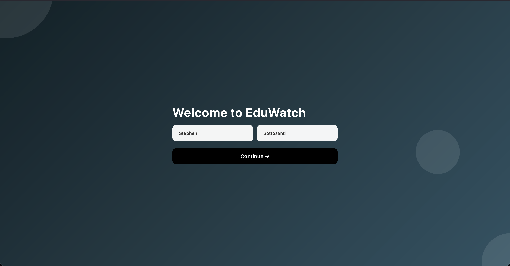
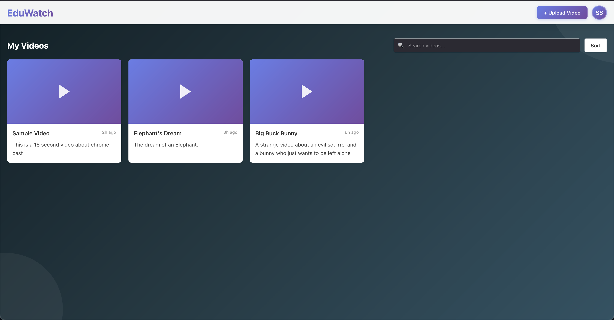
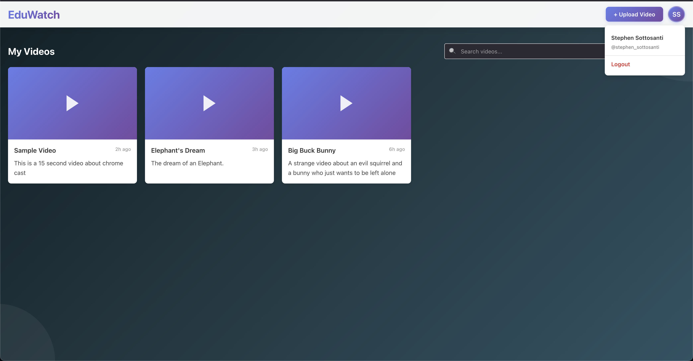
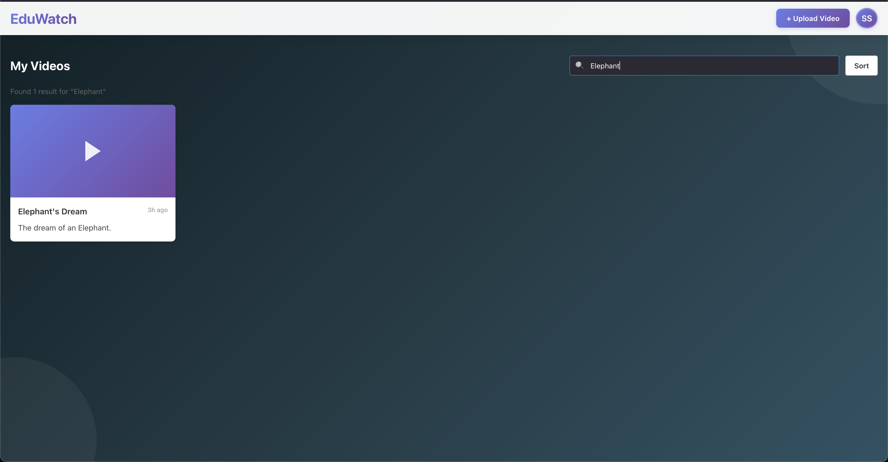
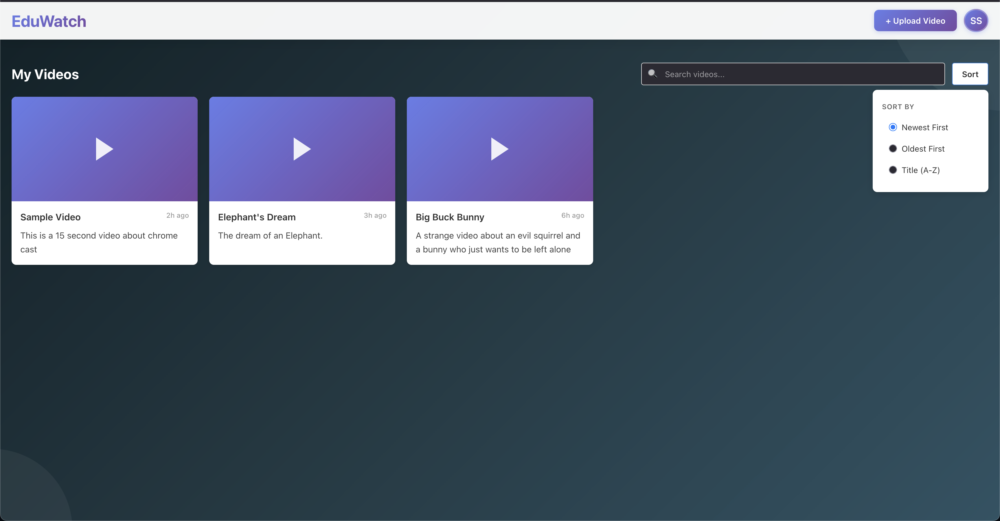
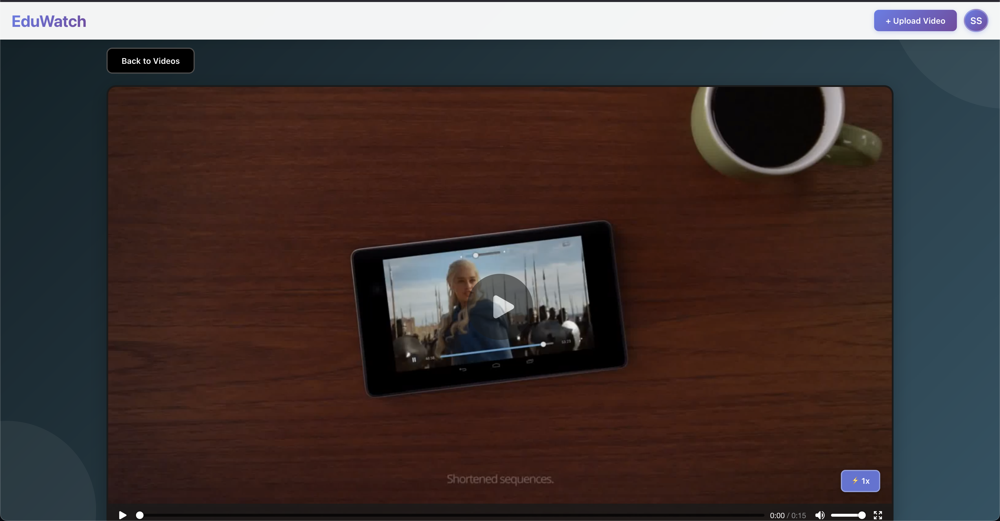
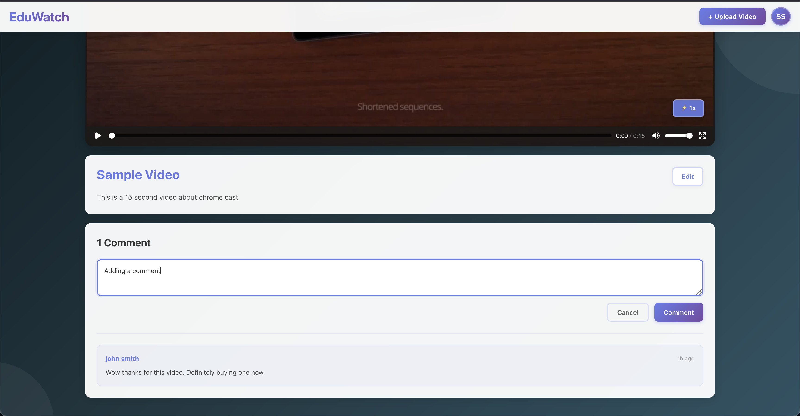
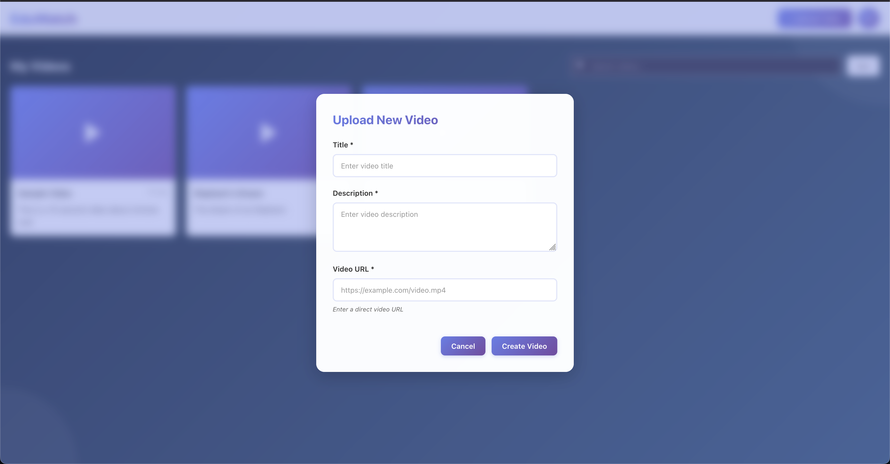
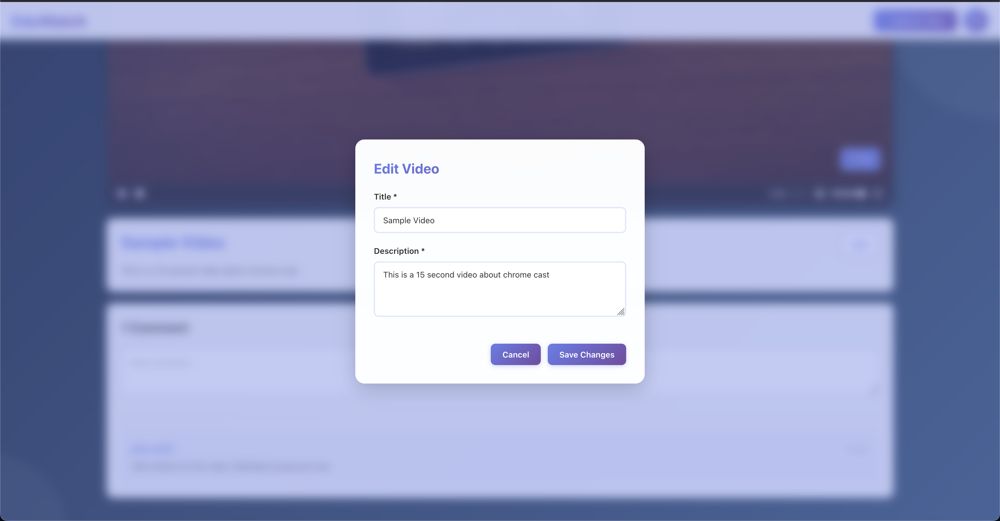

# EduWatch - Educational Video Platform

<div align="center">
  
  
  
</div>

## Features

### Core Functionality
- **User "Authentication"**: Simple name-based user identification system
- **Video Management**: 
  - Upload videos with title, description, and URL
  - Edit video (title and description)
  - View all your uploaded videos in a grid layout
- **Video Playback**:
  - Custom video player with playback speed controls (0.5x, 1x, 1.5x, 2x)
  - Back navigation to video list
- **Comments System**:
  - Add comments to any video
  - View all comments with timestamps
- **Search & Filter**:
  - Search videos by title or description
  - Sort videos by: Newest first, Oldest first, or Title (A-Z)
  - Real-time search results

### UI/UX Features
- **Toast Notifications**: User-friendly feedback for all actions
- **Modal Dialogs**: Clean modal interfaces for upload and edit forms
- **Profile Management**: User profile dropdown with "logout" functionality
- **Animated Elements**: Smooth transitions and hover effects throughout

## Technology Stack

- **Frontend Framework**: React 19.1.1
- **Build Tool**: Vite 7.1.7
- **Styling**: Pure CSS with modern features (gradients, backdrop-filter, animations)
- **State Management**: React Hooks (useState, useEffect, useRef)
- **HTTP Client**: Native Fetch API
- **Notifications**: react-hot-toast 2.6.0
- **API**: RESTful backend (proxy to https://take-home-assessment-423502.uc.r.appspot.com)

## Final Project Structure

```
frontend/
├── src/
│   ├── components/
│   │   ├── SplashPage/
│   │   │   ├── SplashPage.jsx
│   │   │   └── SplashPage.css
│   │   ├── VideoEdit/
│   │   │   ├── VideoEdit.jsx
│   │   │   └── VideoEdit.css
│   │   ├── VideoList/
│   │   │   ├── VideoList.jsx
│   │   │   └── VideoList.css
│   │   ├── VideoPlayer/
│   │   │   ├── VideoPlayer.jsx
│   │   │   └── VideoPlayer.css
│   │   └── VideoUpload/
│   │       ├── VideoUpload.jsx
│   │       └── VideoUpload.css
│   ├── services/
│   │   └── api.js
│   ├── App.jsx
│   ├── App.css
│   ├── constants.js
│   ├── main.jsx
│   ├── utils.jsx
│   └── index.css
├── public/
├── package.json
├── vite.config.js
└── README.md
```

## Getting Started

### Prerequisites

Before you begin, ensure you have the following installed:
- **Node.js**
- **npm**
- The backend API is already proxied to: `https://take-home-assessment-423502.uc.r.appspot.com`

### Installation

1. **Clone the repository**
```bash
git clone git@github.com:sottosanti/scopelabs.git
cd frontend
```

2. **Install dependencies**
```bash
npm install
```

3. **Configure API endpoint**
   
   The application uses a proxy to handle CORS restrictions. The proxy is configured in `package.json`:
   ```json
   "proxy": "https://take-home-assessment-423502.uc.r.appspot.com"
   ```
   
   API calls are made to `/api` endpoints which are automatically proxied to the backend server.

4. **Start the development server**
```bash
npm run dev
```

5. **Open your browser**
   
   Navigate to `http://localhost:5173` (or the port shown in your terminal)

## Screenshots

### Splash Page
*Initial welcome screen where users enter their name*


### Video List
*Grid view of all videos with search and filter options*





### Video Player
*Video playback with comments section*



### Upload Video
*Modal form for uploading new videos*


### Edit Video
*Modal form for editing video metadata*


## Testing the Application

### Step-by-Step Testing Guide

1. **Initial Setup**
   - Open the application
   - You should see the splash page
   - Enter your first and last name (Enter "Stephen" "Sottosanti" if you wouuld like to see it with content already)
   - Click "Continue"

2. **Video List View**
   - After login, you'll see the main dashboard
   - If you have no videos, you'll see an empty state
   - Click the "+ Upload Video" button in the header

3. **Upload a Video**
   - Fill in the video details:
     - Title: "My First Video"
     - Description: "This is a test video"
     - Video URL: Use any valid video URL (e.g., a sample MP4)
   - Click "Create Video"
   - You should see a success toast notification
   - The modal closes and the video appears in the list

4. **Search & Filter**
   - Use the search bar to search for videos
   - Click the "Sort" button to change sorting order
   - Try different sort options (Newest, Oldest, Title A-Z)

5. **Watch a Video**
   - Click on any video card
   - The video player opens with the video
   - Test playback speed controls
   - Try different speeds: 0.5x, 1x, 1.5x, 2x

6. **Edit a Video**
   - While viewing a video, click "Edit" button
   - Modify the title or description
   - Click "Save Changes"
   - Verify the changes are reflected

7. **Add Comments**
   - Scroll down to the comments section
   - Type a comment in the text area
   - Click "Comment" button
   - Your comment appears instantly

8. **Logout**
   - Click your initials in the top right
   - Click "Logout" in the dropdown
   - You'll be returned to the splash page

### Test Data Suggestions

Here are some sample video URLs you can use for testing:
- Big Buck Bunny: `http://commondatastorage.googleapis.com/gtv-videos-bucket/sample/BigBuckBunny.mp4`
- Elephant Dream: `http://commondatastorage.googleapis.com/gtv-videos-bucket/sample/ElephantsDream.mp4`
